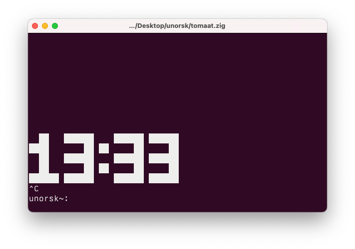

# Simple countdown pomodoro timer in Zig



# How to build it locally

This will build a binary and put it into your `/usr/local/bin`

```
zig build install --prefix-exe-dir /usr/local/bin --verbose
```